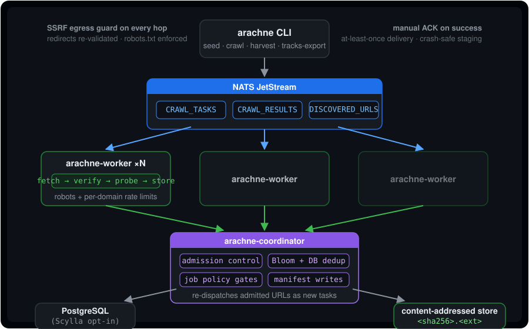
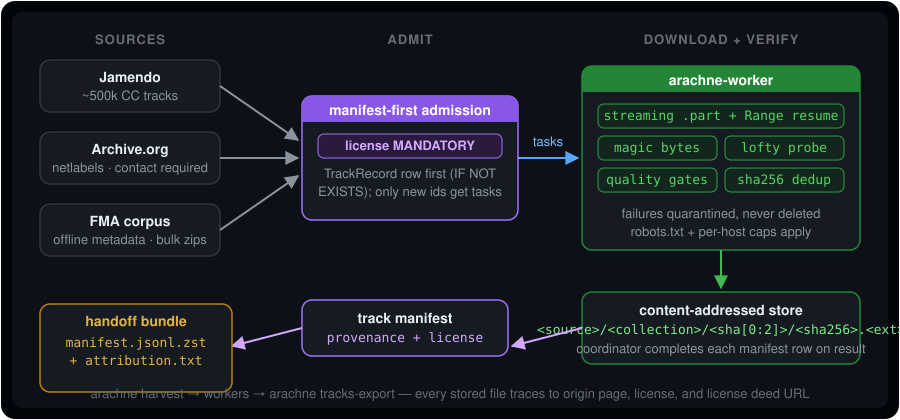

<h1 align="center">Arachne</h1>

<p align="center"><strong>A high-throughput web crawler and licensed-media harvest engine, in pure Rust.</strong><br/>
Crawl pages at scale — or mass-harvest licensed audio/video/documents into a content-addressed store with a complete, license-tracked manifest. Built for ML dataset construction (first customer: <a href="https://github.com/Noel-Alex/Sivana">Sivana</a>, audio fingerprinting), data pipelines, and AI agents.</p>

<p align="center">
  <a href="https://github.com/Noel-Alex/Arachne/actions/workflows/ci.yml"></a>
  
  
  
</p>

<p align="center">
  
</p>

## What it does

- **Page crawling** — polite, robots-respecting, deduplicated crawling with per-job limits: depth, page counts, per-domain caps, content size (topic focus is accepted but enforced only from M2).
- **Licensed media harvesting** — `arachne harvest` pulls entire legal catalogs (Jamendo ~500k CC tracks, Internet Archive netlabels, the FMA research corpus) through a streaming downloader: resumable, magic-byte-verified, probed, quality-gated, quarantined-not-deleted on failure.
- **Organic media discovery** — pages crawled normally also yield sitemaps, RSS/Atom feeds (with audio enclosures), and direct media links; candidates flow back through admission as download tasks — license-gated.
- **Job policy enforcement** — `follow_external_links` gated by seed-root lineage, `max_pages_per_domain` enforced at admission, Bloom pre-filter ahead of every DB existence check.
- **Provenance end-to-end** — every stored file traces back to its source catalog page, its license + deed URL, and the exact page that linked it.
- **SSRF-hardened egress** — private ranges, loopback, link-local/cloud-metadata, IPv4-mapped IPv6, and non-standard ports are blocked on the initial URL *and re-validated on every redirect hop*.

## Architecture

Three binaries share one workspace around NATS JetStream:

| Crate | Role |
|---|---|
| `arachne-core` | Models, repository facade (Postgres default / Scylla opt-in), NATS manager, politeness + robots, discovery (sitemaps, feeds, media links), SSRF egress guard, audio probing, content-addressed media store, metrics |
| `arachne-worker` | Fetches tasks: HTML pipeline for pages (charset cascade, link/media/feed discovery), streaming binary pipeline for audio/video/documents |
| `arachne-coordinator` | Consumes results & discovered URLs; admission control, Bloom + DB dedup, job policy gates, track-manifest completion |
| `arachne-cli` | The `arachne` binary: seed, crawl, harvest, status, export, tracks-export |
| `arachne-tools` | Source adapters (`jamendo`, `archive-org`, `fma`) + stress tools |

Durability properties:

- **At-least-once delivery** — manual ACK only after success everywhere; a failed persist leaves messages for redelivery. JetStream consumers use 600s `ack_wait` (long downloads) and durable names derived from the host, so a restarted worker adopts its own previous consumer.
- **Crash-safe staging** — media downloads stream to `.part` files behind exclusive OS file locks with HTTP Range resume; contended attempts fall back to private staging files rather than sharing bytes.
- **Single-writer manifests** — workers only download; the coordinator is the single writer of track-manifest status transitions.

## Media harvesting pipeline

`arachne harvest -s <source>` enumerates a catalog via its adapter, admits manifest rows (**license mandatory** — no license ⇒ no task), and publishes download tasks. Workers stream files through verification gates into the content-addressed store; the coordinator completes each manifest row as results arrive. `arachne tracks-export` then emits the handoff bundle.

<p align="center">
  
</p>

### Sources

| Source | Command | Catalog |
|---|---|---|
| Jamendo | `harvest -s jamendo` | ~500k Creative Commons tracks (needs a free `client_id`) |
| Internet Archive | `harvest -s archive-org` | netlabels collection, redistributable-only licenses (contact email **required**) |
| FMA corpus | `harvest -s fma-small \| fma-medium \| fma-large \| fma` | ISMIR-2017 dataset, offline enumeration from metadata zips |

Read [`docs/SOURCES.md`](docs/SOURCES.md) before bulk runs — it documents each source's etiquette envelope and what the adapters enforce (Jamendo quota handling, archive.org's bots policy and forbidden collections, FMA licensing columns).

### Media kinds

| Kind | Verification | Extra processing |
|---|---|---|
| `AudioFile` | magic bytes (mp3/flac/ogg/wav/m4a/aac) | lofty probe (duration/bitrate/tags) + quality gates: 30 s–30 min, ≥96 kbps by default |
| `VideoFile` | magic bytes (mp4/mkv/webm/avi/mov) | — |
| `DocumentFile` | magic bytes (pdf/epub/doc(x)/ppt(x)/txt) | — |
| `BinaryFile` | none (opaque asset) | — |

Rejected or failed downloads are **quarantined** under `media_store/quarantine/<reason>/`, never silently deleted. All kinds are stored content-addressed; only audio carries probe metadata and quality gates today.

## Quick start

Prereqs: Rust stable (edition 2024), Docker Compose, ~2 GB free for the stack.

### 1. Infrastructure

```bash
docker compose up -d postgres nats
# optional monitoring:
docker compose up -d prometheus grafana loki promtail
```

(ScyllaDB is available under the `legacy-scylla` profile if you want the legacy backend.)

### 2. Build & run the pipeline

```bash
cargo build --release
./target/release/arachne-coordinator &
./target/release/arachne-worker &
```

### 3. Harvest something real

```bash
# Jamendo (~500k CC tracks; free client_id from developer.jamendo.com)
export JAMENDO_CLIENT_ID=your_id
./target/release/arachne harvest -s jamendo --limit 1000

# Internet Archive netlabels (CC-licensed; --contact is REQUIRED by their bots policy)
./target/release/arachne harvest -s archive-org --contact you@example.com --limit 200

# FMA research corpus (offline enumeration from fma_metadata.zip; no API key)
./target/release/arachne harvest -s fma-small   # 8k x 30s clips (7 GB)
./target/release/arachne harvest -s fma         # full large subset (106k tracks, ~100 GB zip)
```

Downloads run through any started workers; watch progress via logs or Grafana. An unknown `-s` value exits nonzero with the valid list.

### 4. Export the handoff bundle

```bash
./target/release/arachne tracks-export -s jamendo -o ./handoff
# → handoff/manifest.jsonl.zst  (one TrackRecord per line, zstd)
# → handoff/manifest.json      (counts by status/format/license, totals)
# → handoff/attribution.txt    (per-track credits grouped by license)
```

Each manifest row carries title/artist/album/year, duration/bitrate/format, sha256, byte size, store path, license id **and deed URL**, plus `origin_page_url` / `discovered_from_url` provenance. Add `--include-incomplete` to also export pending/failed/rejected rows.

### 5. Page crawling

```bash
./target/release/arachne crawl \
  --seeds "https://example.org" \
  --max-pages 5000 --max-depth 3 \
  --allowed-domains "example.org" \
  --default-license "cc-by" \
  --name demo-crawl
```

Useful flags beyond the basics: `--max-pages-per-domain`, `--follow-external`, `--crawl-delay` (stored; enforcement lands in M2), `--topic "rust,crawling"` (stored; keyword scoring lands in M2), `--ignore-robots` (not recommended; stored — robots.txt is still obeyed until enforcement lands in M2).

`--default-license` governs organically-discovered media: audio/video/document links found on crawled pages become download tasks **only** when a license can be attributed — either from the job's `--default-license` or nowhere at all.

## Observability

| Endpoint | What |
|---|---|
| worker `http://localhost:9191/metrics` | pages crawled/failed, URLs discovered/deduped/robots-blocked, bytes downloaded, audio harvested/rejected/failed, malformed messages, active tasks, crawl-duration + page-size histograms |
| coordinator `http://localhost:9192/metrics` | fleet-truth counts plus live gauges: `arachne_frontier_size` (tasks-stream depth), `arachne_jobs_running` |

```bash
docker compose up -d prometheus grafana loki promtail
# Grafana UI: http://localhost:3001 (admin / $GRAFANA_PASSWORD, default admin)
```

The provisioned dashboard **Arachne — Crawl & Harvest Overview** plots throughput, harvest/reject rates, bandwidth, dedup pressure, and crawl-duration percentiles out of the box.

> Linux hosts: add `extra_hosts: ["host.docker.internal:host-gateway"]` to the prometheus service so it can scrape host-run binaries.

## Configuration

Layered, highest wins last: compiled defaults ← `config/default.toml` ← `ARACHNE_*` environment variables (double underscore nests sections, e.g. `ARACHNE_DATABASE__URL`). See [`config/example.env`](config/example.env) for every key with comments.

Key sections: `[database]` (backend `postgres` default / `scylla` legacy, url, pool), `[nats]`, `[worker]` (concurrency, timeouts, redirects, UA), `[politeness]` (robots TTL, delays), `[media]` (store dir, size caps, quality gates, per-host concurrency, free-space floor), `[storage]`, `[metrics]`.

## Security posture

Arachne crawls hostile pages by design, so egress and licensing are treated as security boundaries, not features:

- **Static SSRF guard on every URL before fetch** — blocks non-HTTP(S) schemes, non-standard ports, loopback/private/link-local ranges, cloud-metadata endpoints (169.254.169.254), "this-network" (0.0.0.0/8), IPv4-mapped IPv6 forms (re-checked against IPv4 rules), unique-local IPv6 (`fc00::/7`), and literal `localhost`/`.local`/`.internal` hostnames.
- **Redirect hops re-validated** — the reqwest client uses a custom redirect policy that runs the same guard on *every* 30x target, closing the classic follow-the-redirect bypass where only the original URL was checked. Blocked hops abort the request.
- **License-gated admission** — no license ⇒ no task ⇒ no file ever enters the store. Organic discovery inherits the job's `--default-license`; adapters refuse unlicensed/unknown-license items.
- **Quarantine, not delete** — wrong magic bytes, unprobeable files, and quality rejects are preserved under `media_store/quarantine/<reason>/` for inspection.
- **Contact-required sources honored at the adapter layer** — archive.org's Bots policy contact address is enforced for catalog enumeration by the CLI (`--contact` or `ARACHNE_CONTACT`); bulk **download** requests carry the configured worker User-Agent instead, so set `ARACHNE_WORKER__USER_AGENT` with your contact before sustained harvests (see [SOURCES.md](docs/SOURCES.md)). robots.txt and per-source rate envelopes apply to page and media fetches alike.

Known gap (documented in code): a DNS name that passes the static check can still resolve to a private IP at connect time (TOCTOU vs. the resolver) — roadmap item. Report vulnerabilities per [SECURITY.md](SECURITY.md).

## Docs

| Document | Contents |
|---|---|
| [`docs/ADR/000-charter.md`](docs/ADR/000-charter.md) | Project charter: user archetypes, differentiators, explicit non-goals |
| [`docs/SOURCES.md`](docs/SOURCES.md) | Per-source etiquette & legal notes — read before bulk runs |
| [`docs/CONTRACT.md`](docs/CONTRACT.md) | The Sivana handoff contract: schema, guarantees, licensing posture |
| [`docs/SCALING_GUIDE.md`](docs/SCALING_GUIDE.md) | Throughput architecture notes (pre-Postgres messaging numbers still accurate) |
| [`CHANGELOG.md`](CHANGELOG.md) | Notable changes per Keep-a-Changelog |

## Roadmap

Charter milestones ([docs/ADR/000-charter.md](docs/ADR/000-charter.md)):

- **M0-M1 — done**: consolidation + Sivana end-to-end (Postgres/NATS stack, live-validated).
- **M2 — fleet-safe spine**: domain-sharded subjects, DLQ, stable durable consumers, shard-affinity politeness for the residential-swarm model.
- **M3 — extraction & catalog quality**: keyword scoring wired into admission, richer extraction recipes.
- **M4 — REST + MCP API**: the programmatic/web interface; agent-native control plane.
- **M5 — recipes & HF datasets**: one-command corpus builds pushed to Hugging Face.

## License

MIT
